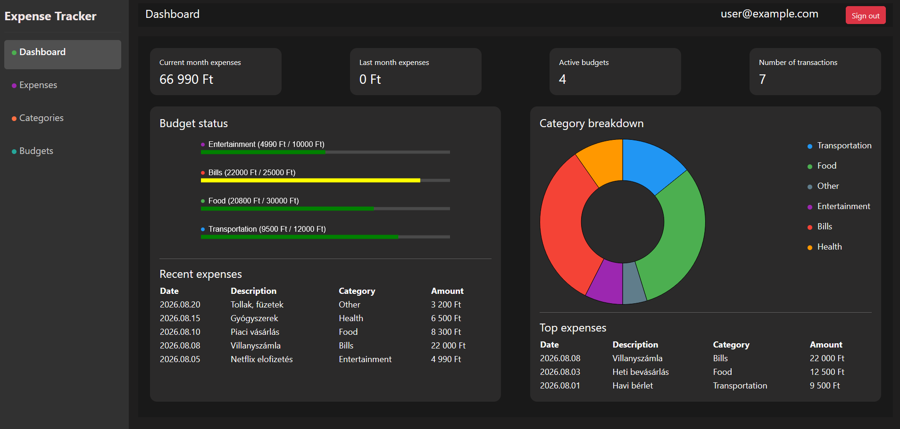
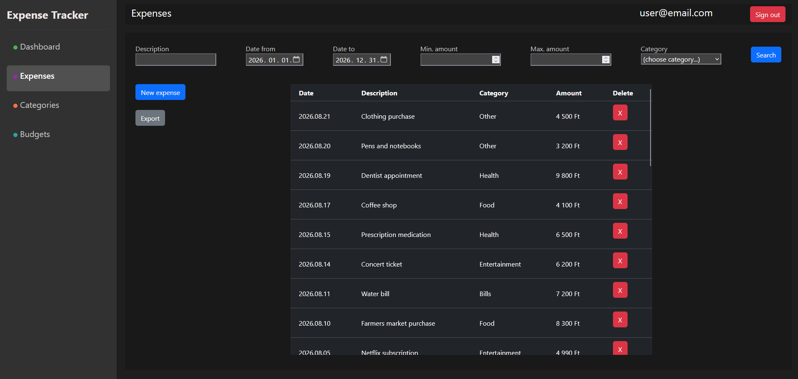
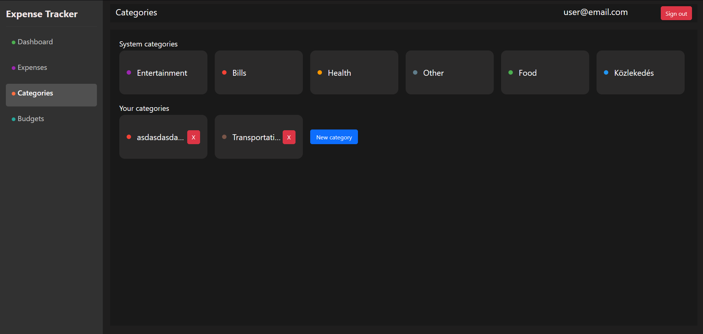
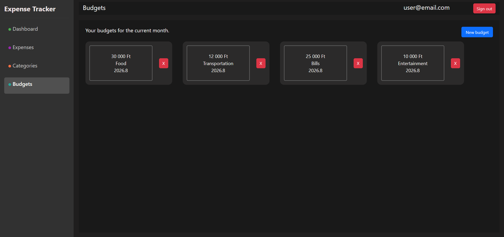

# Expense Tracker – Frontend

An Angular-based single-page application that serves as the client-side (frontend) of the [Expense Tracker](https://github.com/Tbig94/ExpenseTracker) application. It consumes the [expense-tracker-backend](https://github.com/Tbig94/expense-tracker-backend) REST API to provide users with a way to manage and visualize their income and expenses.

> **Demo credentials**
>
> - Email: user@example.com
> - Password: password

> **Related repositories**
>
> - Backend: [Tbig94/expense-tracker-backend](https://github.com/Tbig94/expense-tracker-backend)

---

## The UI

  
  

  
  

## Features

- **Authentication** – login and registration screens, JWT token handling (storage, attaching to API requests, refresh)
- **Route protection** – guarded routes so only authenticated users can access private pages
- **Expense management** – create, view, edit, and delete expenses through a clean UI
- **Income management** – create, view, edit, and delete income entries
- **Category management** – manage custom categories used to classify transactions
- **Filtering and search** – filter transactions by date range, category, and type (income/expense)
- **Dashboard / summary view** – overview of balance, totals, and category breakdown, optionally visualized with charts
- **Responsive design** – usable on both desktop and mobile screen sizes
- **Form validation** – client-side validation with clear error feedback before hitting the API
- **Centralized API/error handling** – shared HTTP interceptor(s) for attaching auth tokens and handling API errors consistently

---

## Tech Stack

| Layer              | Technology                                                 |
| ------------------ | ---------------------------------------------------------- |
| Framework          | Angular (CLI-generated project)                            |
| Language           | TypeScript                                                 |
| Styling            | CSS / SCSS (Angular component styles)                      |
| State/Data flow    | Angular services + RxJS (Observables)                      |
| HTTP client        | Angular `HttpClient`, with interceptors for JWT auth       |
| Routing            | Angular Router, with route guards for protected pages      |
| Testing            | Vitest (unit tests), configurable e2e framework            |
| Build tool         | Angular CLI / Angular build system                         |
| Hosting/Deployment | Azure Static Web Apps (`staticwebapp.config.json`)         |
| CI                 | GitHub Actions (automated build and test on every push/PR) |

---

## Main Pages / Routes

| Route         | Description                                   | Auth required |
| ------------- | --------------------------------------------- | ------------- |
| `/login`      | User login page                               | No            |
| `/register`   | User registration page                        | No            |
| `/dashboard`  | Overview of balance, totals, and summaries    | Yes           |
| `/expenses`   | List, create, edit, and delete expenses       | Yes           |
| `/incomes`    | List, create, edit, and delete income entries | Yes           |
| `/categories` | Manage transaction categories                 | Yes           |
| `/profile`    | View/update user account details              | Yes           |

---

## License

The license terms of the project are defined in the `LICENSE` file in the repository (if present). If the file is not currently included in the repository, it is advisable to add a suitable open-source license (e.g., MIT).
